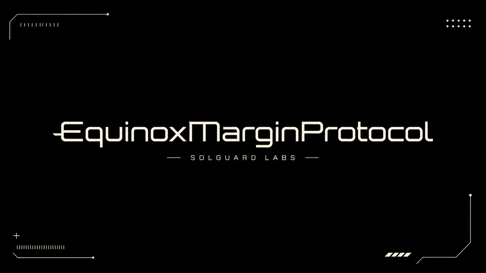
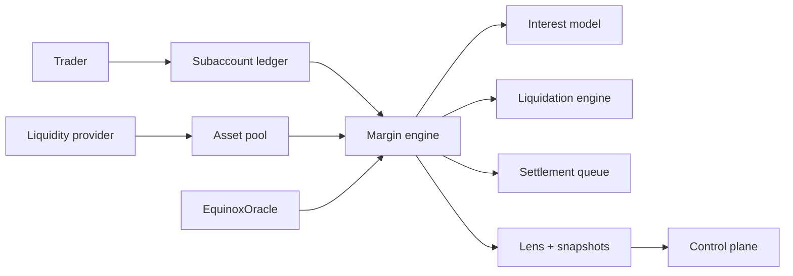
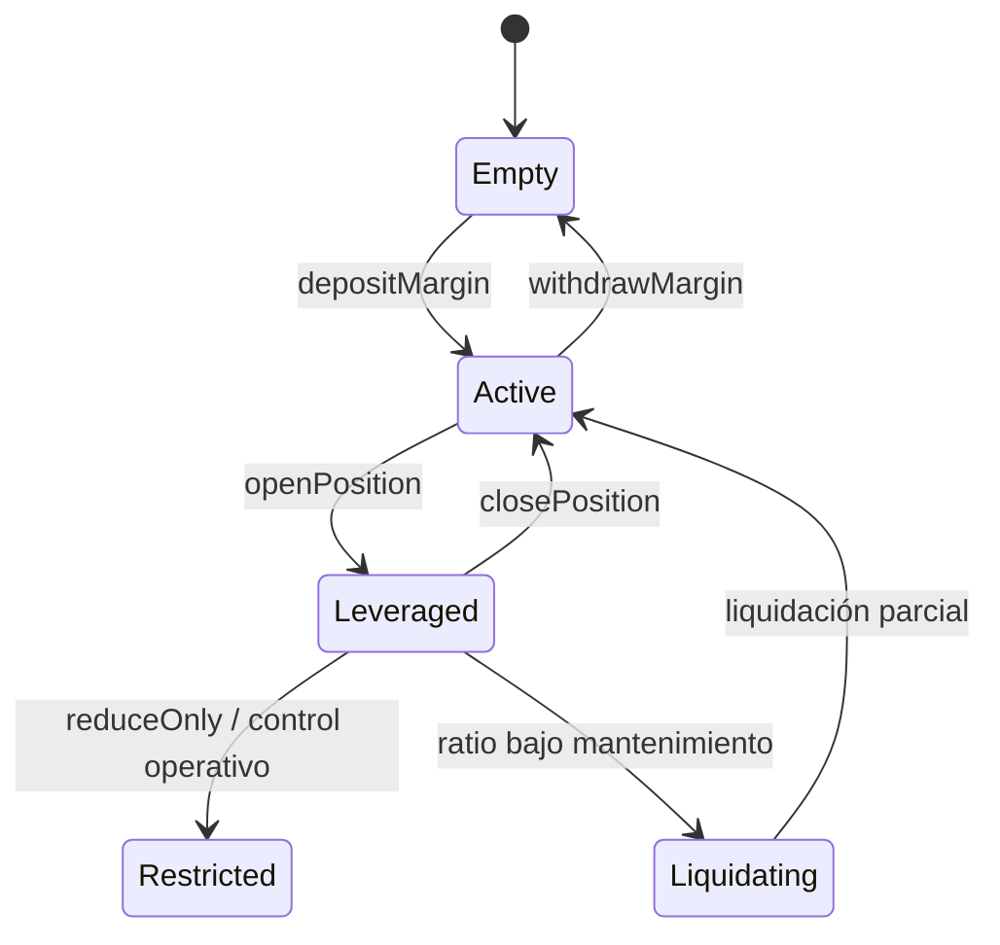
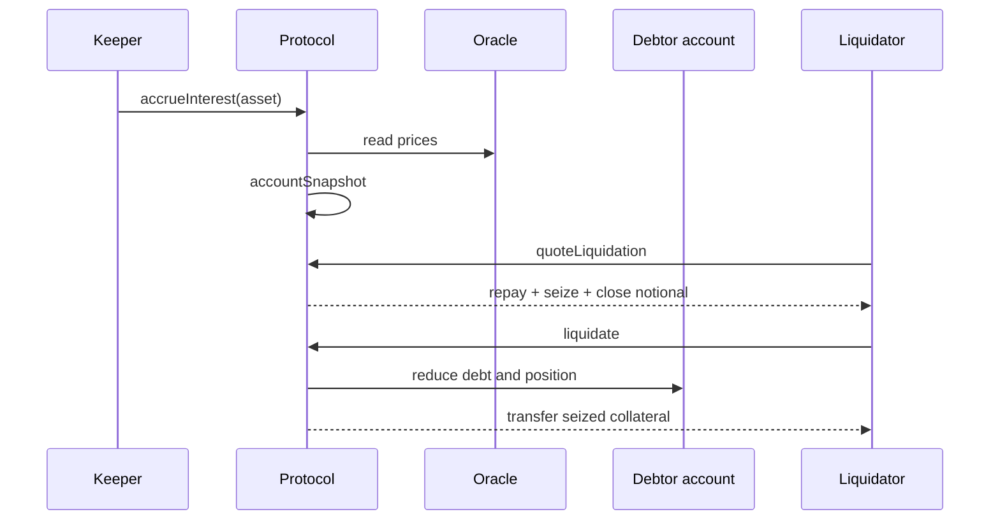
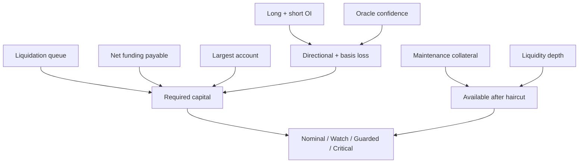

<h1 align="center">EquinoxMarginProtocol</h1>

<p align="center">
    [](https://github.com/SolguardLabs/EquinoxMarginProtocol/actions/workflows/ci.yml)
    [](https://github.com/SolguardLabs/EquinoxMarginProtocol/actions/workflows/release-integrity.yml)
    [](https://soliditylang.org/)
    [](https://nodejs.org/)
</p>



EquinoxMarginProtocol es un motor de margen multi-activo con subcuentas aisladas, pools de liquidez, mercados perpetuos, interés por utilización y liquidación parcial. Los contratos mantienen toda la contabilidad en unidades enteras, separan configuración de activos y mercados y exponen snapshots de salud reproducibles.

La suite incluye un motor independiente de stress para evaluar pérdida direccional, basis, confianza del oracle, colas de liquidación, funding, concentración y profundidad de mercado antes de admitir nueva exposición.

## Arquitectura



| Componente              | Responsabilidad                                              |
| ----------------------- | ------------------------------------------------------------ |
| `EquinoxMarginProtocol` | depósitos, posiciones, deuda, transferencias y liquidaciones |
| `EquinoxOracle`         | precios con propietario, timestamp y ventana máxima          |
| `InterestRateModel`     | utilización, curva kinked e índice de préstamo               |
| `RiskMath`              | valoración, margen, PnL y cálculos de liquidación            |
| `SettlementQueue`       | órdenes pendientes y ejecución secuenciada                   |
| `EquinoxLens`           | lecturas agregadas para servicios y dashboards               |
| `CapitalStressEngine`   | evaluación conservadora por mercado y cartera                |

## Ciclo de una subcuenta



Cada subcuenta conserva listas independientes de colateral, deuda y mercados. Las funciones que reducen respaldo vuelven a calcular la salud antes de confirmar la transición.

## Modelo económico

Los precios y ratios usan precisión WAD (`1e18`); las políticas usan basis points (`10_000 = 100%`).

```text
utilization = debt / (cash + debt)
borrowRate = base + slope(utilization, kink)
borrowIndexAfter = borrowIndexBefore × (1 + ratePerSecond × elapsed)
currentDebt = principal × poolBorrowIndex / accountDebtIndex

weightedCollateral = Σ(assetValue × collateralFactor)
marginRatio = (weightedCollateral + unrealizedPnl) / debtValue
```



## Stress de capital



El stress no muta el protocolo. Su resultado es una señal para gates externos de exposición, pausas por mercado y revisión de límites.

## Inicio rápido

Requisitos: Node.js `24.x` y npm `11.x`.

```bash
npm ci
npm run compile
npm test
npm run ci
```

Consulta de una subcuenta con TypeChain:

```ts
const snapshot = await protocol.accountSnapshot(owner, subAccountId);
if (!snapshot.healthy) {
    console.warn("La subcuenta requiere reducción de riesgo");
}
```

## Documentación

- [Arquitectura](docs/01-arquitectura.md)
- [Cuentas y margen](docs/02-cuentas-y-margen.md)
- [Interés y liquidez](docs/03-interes-y-liquidez.md)
- [Liquidaciones](docs/04-liquidaciones.md)
- [Stress de capital](docs/05-stress-de-capital.md)
- [Operación y observabilidad](docs/06-operacion-y-observabilidad.md)
- [Despliegue](docs/07-despliegue.md)
- [Política de seguridad](SECURITY.md)

## Garantías de ingeniería

- Solidity `0.8.24`, optimizer y `viaIR` fijados.
- Aritmética WAD/BPS con redondeos explícitos.
- Pools, deuda, reservas y shares reconciliables por activo.
- Oracle con control de antigüedad y actualización por lotes.
- 16 pruebas públicas y bindings TypeChain versionados.
- Control EIP-170, TypeScript estricto y lockfile npm.
- CI en Ubuntu y Windows y promoción verificable a `production`.

## Licencia

Distribuido bajo los términos de [MIT](LICENSE).
