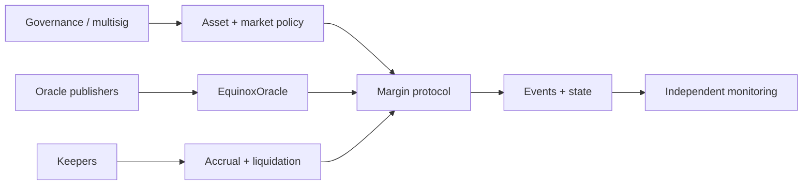
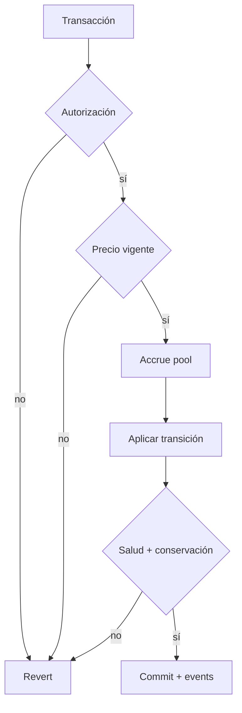

# Política de seguridad

## Versiones mantenidas

| Serie   | Estado            |
| ------- | ----------------- |
| `1.x`   | Mantenida         |
| `< 1.0` | Sin mantenimiento |

`main` representa la integración revisada. `production` debe apuntar al mismo commit promovido, y cada entrega estable usa un tag anotado `vMAJOR.MINOR.PATCH`.

## Límites de confianza

Los contratos validan contabilidad y salud on-chain. La operación debe proteger claves administrativas, calidad del oracle, orden de transacciones, configuración de keepers, políticas de pausa y observabilidad.



## Controles de integración

- usar multisig y demora para cambios de propietario, oracle y parámetros;
- separar publicadores de precio, keepers, tesorería y despliegue;
- validar `chainId`, dirección, bytecode, versión y confirmations;
- rechazar precios fuera de ventana o con confianza insuficiente;
- limitar slippage, gas, notional y exposición por mercado;
- serializar acciones por subcuenta en servicios que construyan lotes;
- reconciliar deuda agregada, cash, shares y reservas por activo;
- mantener runbooks de `pause`, `reduceOnly` y recuperación de oracle.

## Invariantes operativos



```text
pool.cash + poolDebtCurrent >= reserveBalance
pool.borrowIndex >= 1e18
account debt principal = 0  =>  account debt index = 0
withdraw amount <= previewLiquidityWithdrawal
liquidation repay <= closeFactor × currentDebt
healthy transition => weightedCollateral + PnL >= debt + requirements
```

Un evento no sustituye una lectura de estado confirmada. Los indexadores deben tolerar reorganizaciones y volver a calcular desde el último bloque finalizado.

## Comunicación responsable

Utilice **GitHub Security Advisories** en la pestaña Security. No publique escenarios de impacto económico en issues abiertos.

Incluya versión, commit, red, bloque, contratos, precondiciones, transacciones mínimas, resultado observado, impacto por activo y una prueba de regresión propuesta. El equipo confirmará recepción, reproducirá el caso en un fork aislado y coordinará el siguiente paso.

## Dependencias y secretos

Los contratos no consumen secretos. Los secretos de RPC, despliegue y verificación pertenecen al entorno de CI y deben usar permisos mínimos. El runtime on-chain no depende de paquetes npm; el audit automatizado separa por ello dependencias de producción y herramientas de desarrollo.
