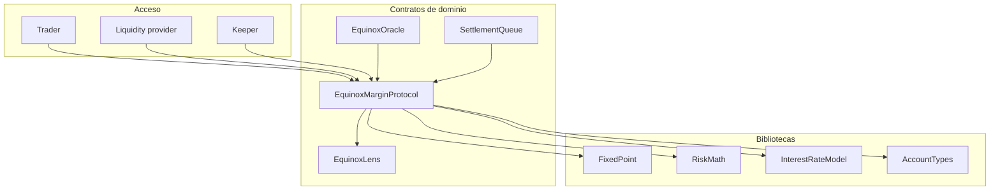
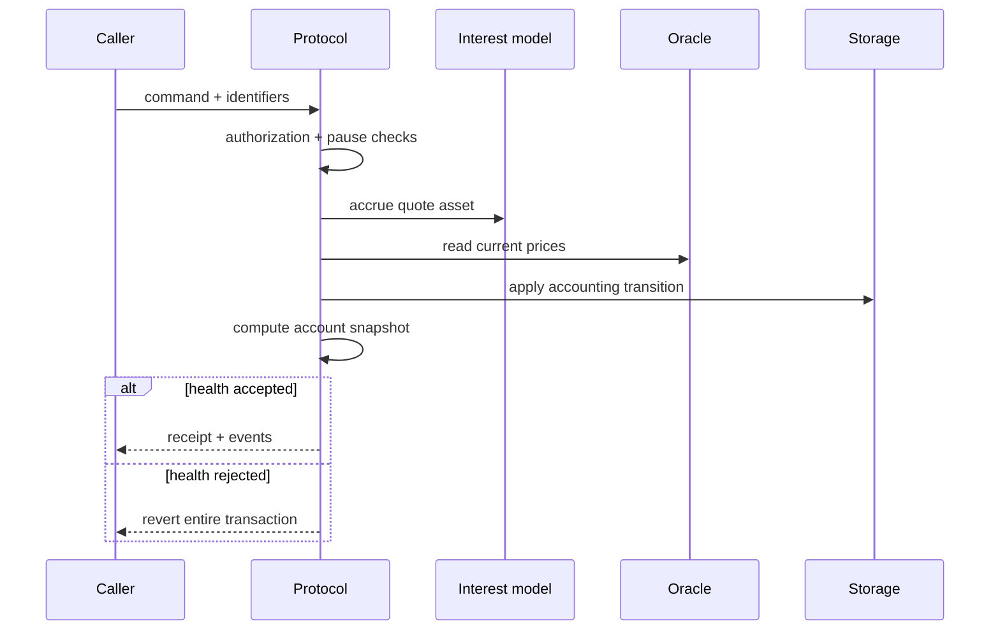
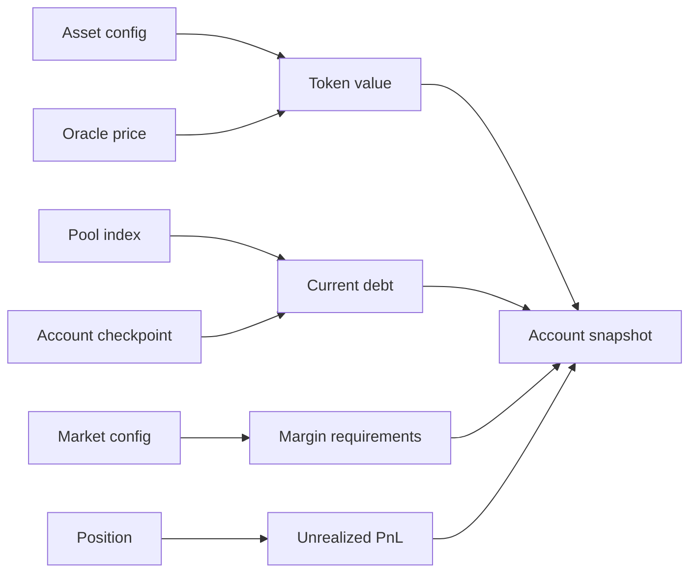

# Arquitectura del protocolo

EquinoxMarginProtocol organiza activos, mercados y subcuentas alrededor de un ledger único. Las rutas de escritura acumulan primero el pool implicado, consultan precios, aplican la transición y vuelven a evaluar salud. Las vistas agregadas no modifican estado.

## Mapa de componentes

| Dominio   | Estado principal                          | Clave                  |
| --------- | ----------------------------------------- | ---------------------- |
| Activo    | token, decimales, factores, flags         | `assetId`              |
| Mercado   | base, quote, leverage, maintenance        | `marketId`             |
| Pool      | cash, shares, principal, índice, reservas | `assetId`              |
| Subcuenta | colateral, deudas, posiciones, nonce      | owner + `subAccountId` |
| Oracle    | precio, timestamp, secuencia              | `assetId`              |

## Ruta de escritura

La atomicidad de EVM impide persistir una transición que termine en revert. Los servicios deben esperar confirmations antes de derivar decisiones posteriores.

## Dependencias de estado

## Principios

- unidades de token se convierten a WAD solo al valorar;
- los arrays de claves permiten enumerar mappings sin duplicados;
- cada pool mantiene su propio reloj e índice;
- el oracle no se sustituye sin una operación administrativa explícita;
- lens y stress engines son de solo lectura respecto al ledger transaccional.
