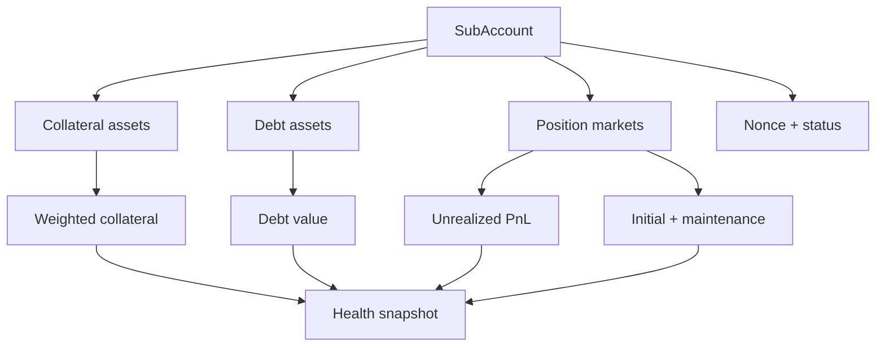
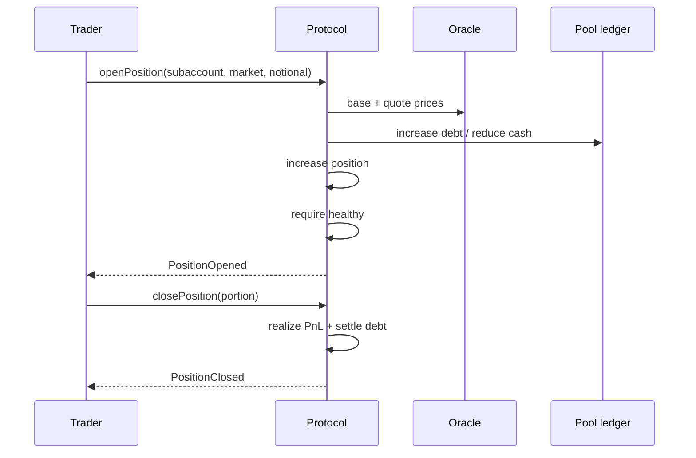
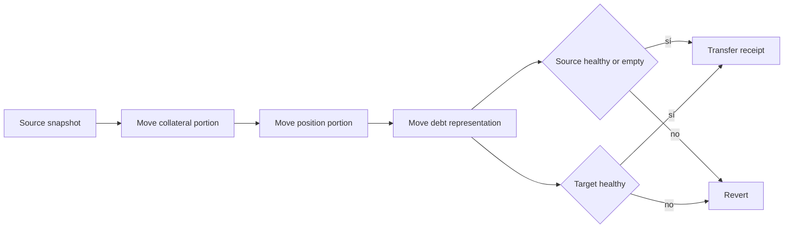

# Cuentas y margen

Una dirección puede operar varias subcuentas aisladas. Cada una mantiene colateral, deuda y posiciones sin netear automáticamente con otras subcuentas. El aislamiento permite límites y liquidaciones precisos, pero exige identificar siempre owner, subcuenta y activo.

## Composición de la cuenta



```text
equity = weightedCollateralValue + unrealizedPnl - debtValue
initialRequirement = Σ(openNotional × initialMarginRate)
maintenanceRequirement = Σ(openNotional × maintenanceRate)
healthy = equity >= initialRequirement
liquidatable = equity < maintenanceRequirement
```

## Apertura y cierre



El cierre parcial calcula PnL sobre el tamaño reducido y amortiza una fracción proporcional de deuda. Si el margen del mismo activo no cubre el repayment, el resto se toma de la wallet mediante `transferFrom`.

## Traslado entre subcuentas



El porcentaje usa basis points y se aplica de forma coherente a notional, tamaño, colateral y principal. Un integrador debe presentar al usuario las snapshots antes y después, el ID de transferencia y los índices de deuda relevantes.

## Reglas de integración

- no reutilizar `subAccountId` entre tenants;
- mostrar deuda actual, no solo principal;
- estimar salud con el mismo bloque y precios que la transacción;
- exigir allowance suficiente para cierres que consuman wallet;
- invalidar previews cuando cambie el índice, el precio o la configuración.
