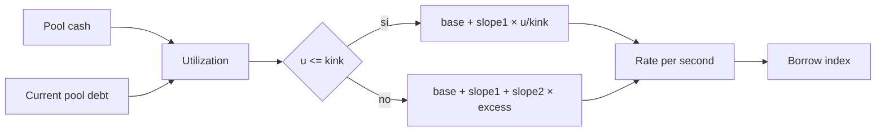
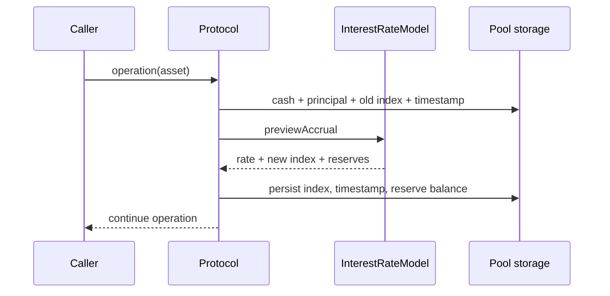
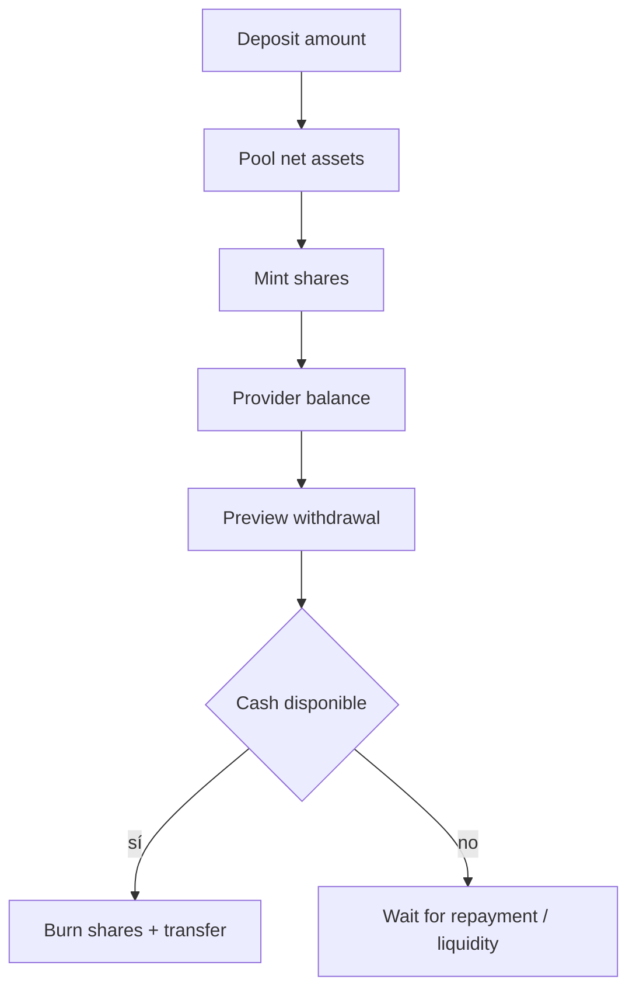

# Interés y liquidez

Cada activo prestable mantiene cash, shares, principal agregado, índice de préstamo y reservas. La curva kinked ajusta el coste por segundo a la utilización. El accrual es discreto: se materializa cuando una operación toca el pool o un keeper llama explícitamente.

## Curva de utilización



```text
u = debt / (cash + debt)
indexDelta = borrowIndex × ratePerSecond × elapsed
interestAccrued = currentDebt × ratePerSecond × elapsed
reserveAccrued = interestAccrued × reserveFactor
```

## Accrual y checkpoints



El principal agregado del pool se normaliza a WAD en el momento del préstamo. Las deudas de cuenta conservan su checkpoint para convertir principal nominal a deuda corriente.

## Shares de liquidez



```text
netAssets = cash + currentPoolDebt - reserveBalance
sharesMinted = deposit × totalShares / netAssetsBefore
withdrawAmount = sharesBurned × netAssets / totalShares
```

La vista económica y la capacidad inmediata son distintas: una share puede representar deuda devengada aunque el cash no permita retirarla en ese bloque.

## Monitoreo recomendado

- utilización y pendiente de la curva por activo;
- edad desde `lastAccrualTime`;
- cash frente a retiros previstos;
- deuda agregada frente a suma de cuentas;
- crecimiento de `reserveBalance`;
- concentración de shares y de borrowers.
