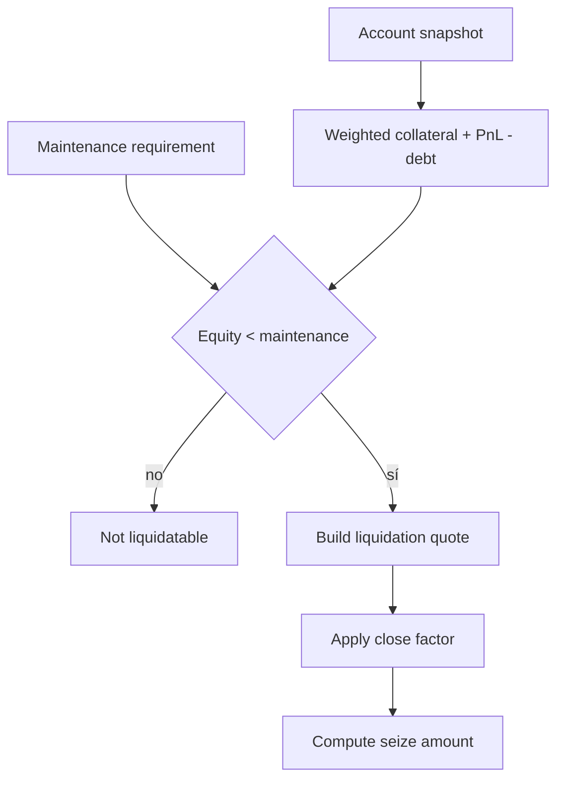
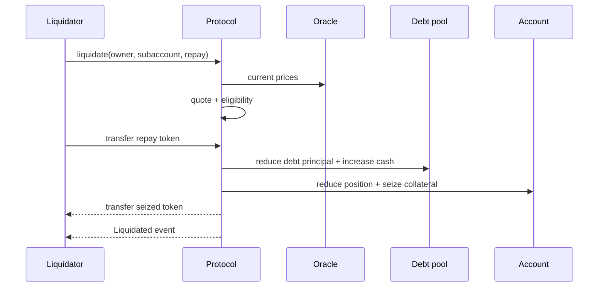
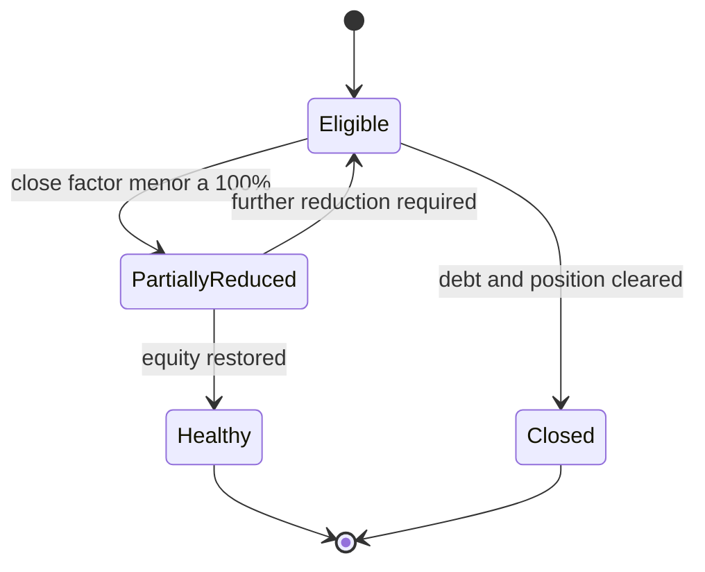

# Liquidaciones

La liquidación reduce deuda y posición cuando el equity cae por debajo del mantenimiento. El quote limita repayment por deuda corriente y close factor, calcula colateral con bonus y devuelve el notional que debe cerrarse.

## Elegibilidad



La lectura de elegibilidad y la ejecución deben ocurrir con precios vigentes. Un quote off-chain es orientativo; el contrato vuelve a evaluar el estado en la transacción.

## Waterfall



```text
repay = min(requested, currentDebt, currentDebt × closeFactor)
repayValue = tokenValue(repay)
seizeValue = repayValue × (1 + liquidationBonus)
closeNotional = openNotional × repay / currentDebt
```

## Estado tras la ejecución



## Política de keeper

- simular con el bloque inmediatamente anterior;
- limitar precio de gas y tamaño de repayment;
- no asumir disponibilidad de colateral sin leer balance;
- registrar quote, tx hash, bloque y deltas finales;
- reintentar por estado, no por texto del revert;
- alertar si varias ejecuciones no restauran salud.
