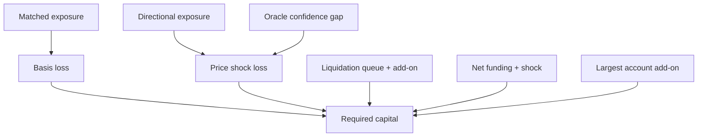
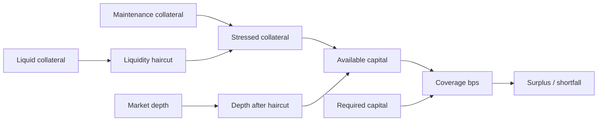
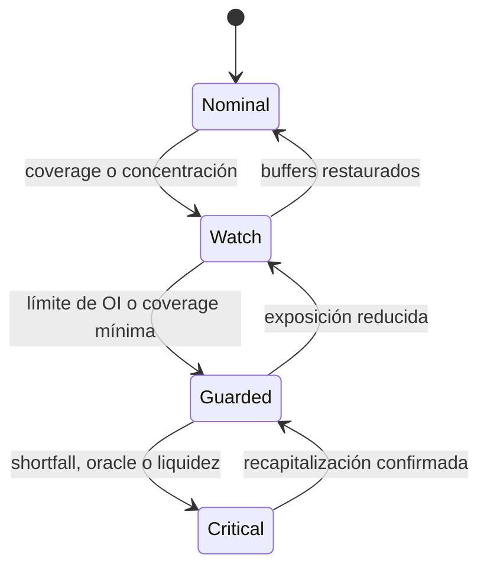

# Stress de capital

`CapitalStressEngine` evalúa si los recursos de un mercado absorben shocks simultáneos. Es un contrato puro: recibe exposición y política completas, no consulta el estado transaccional y no puede pausar ni modificar límites.

## Waterfall requerido



```text
directional = abs(longOI - shortOI)
matched = min(longOI, shortOI)
stressedLoss = ceil(directional × priceShock)
             + ceil(matched × priceShock / 4)
             + ceil(grossOI × (1 - oracleConfidence))
required = stressedLoss + liquidationNeed + fundingNeed + concentrationAddon
```

Cada requerimiento redondea hacia arriba. Los recursos líquidos, en cambio, aplican haircut con redondeo hacia abajo.

## Recursos y cobertura



```text
stressedCollateral = maintenanceCollateral + floor(liquidCollateral × (1 - haircut))
stressedLiquidity = floor(liquidityDepth × (1 - haircut))
available = stressedCollateral + stressedLiquidity
coverage = available / required
```

## Bandas y señales



| Señal         | Bit | Interpretación                     |
| ------------- | --: | ---------------------------------- |
| Shortfall     |   1 | recursos menores que requerimiento |
| Open interest |   2 | OI supera política sobre cap       |
| Concentración |   4 | una cuenta domina el mercado       |
| Oracle        |   8 | confianza inferior al mínimo       |
| Liquidez      |  16 | depth estresado menor que la cola  |

El plano de control debe mapear bandas a límites concretos: revisión, reducción de caps, `reduceOnly` o pausa. Los parámetros se versionan y se comparan contra escenarios históricos antes de activarlos.
