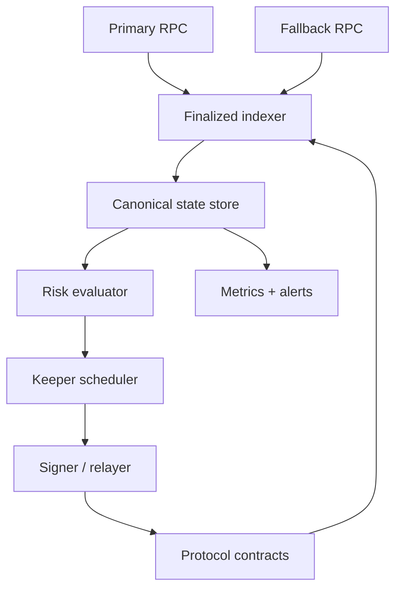
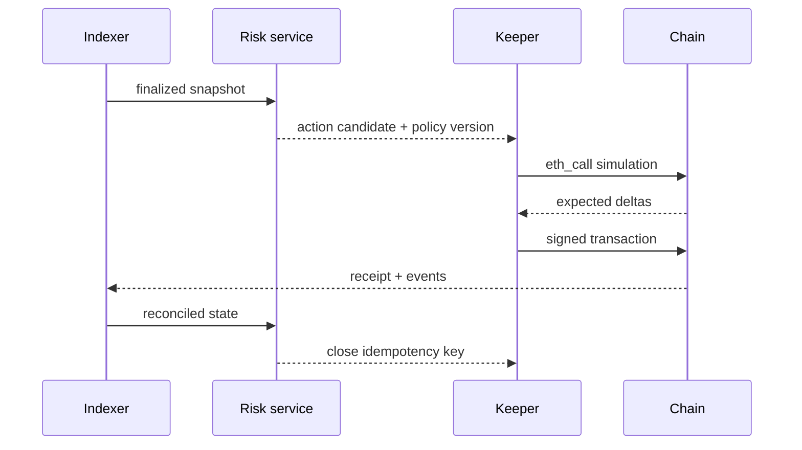
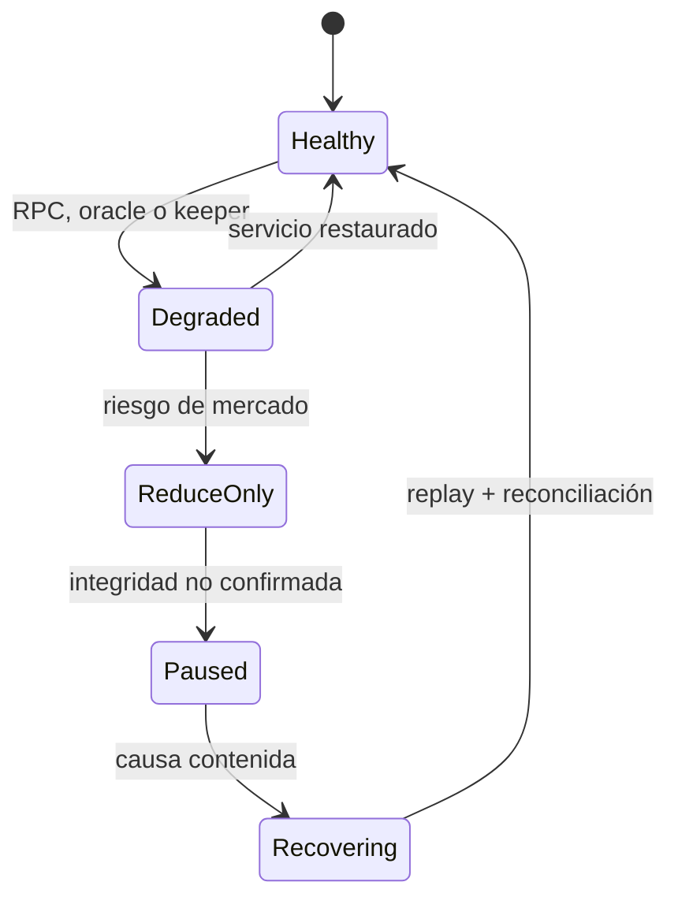

# Operación y observabilidad

La operación combina indexación confirmada, keepers idempotentes, evaluación de riesgo y procedimientos por activo o mercado. Ningún servicio debe depender solo de eventos pendientes de finalización.

## Topología operativa

El signer solo recibe llamadas previamente construidas y permitidas. El scheduler fija chain ID, dirección, nonce, gas y deadline; el signer no decide parámetros económicos.

## Ciclo de keeper

La clave de idempotencia combina acción, owner, subcuenta, activo/mercado, bloque de decisión y versión de política. Una transacción reemplazada conserva la misma intención.

## Respuesta a incidentes

Runbook mínimo:

1. fijar red, bloque, contrato, activo y mercado;
2. detener nuevas acciones de riesgo en el perímetro afectado;
3. comparar dos RPC y el oracle autorizado;
4. capturar configuración, bytecode, storage relevante y transacciones;
5. reproducir sobre fork del bloque fijado;
6. reconciliar cash, deuda, shares, reservas y cuentas;
7. restaurar límites de forma gradual con observación reforzada.

## Métricas

Mantenga utilización, borrow APR, edad del accrual, cash disponible, retiros previstos, deuda agregada, reservas, health buckets, liquidaciones pendientes, concentración, confianza del oracle y bandas de stress. IDs de cuenta y transacción pertenecen a logs/traces, no a labels de alta cardinalidad.
