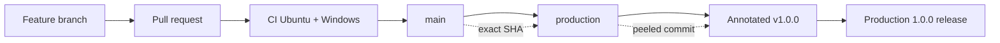
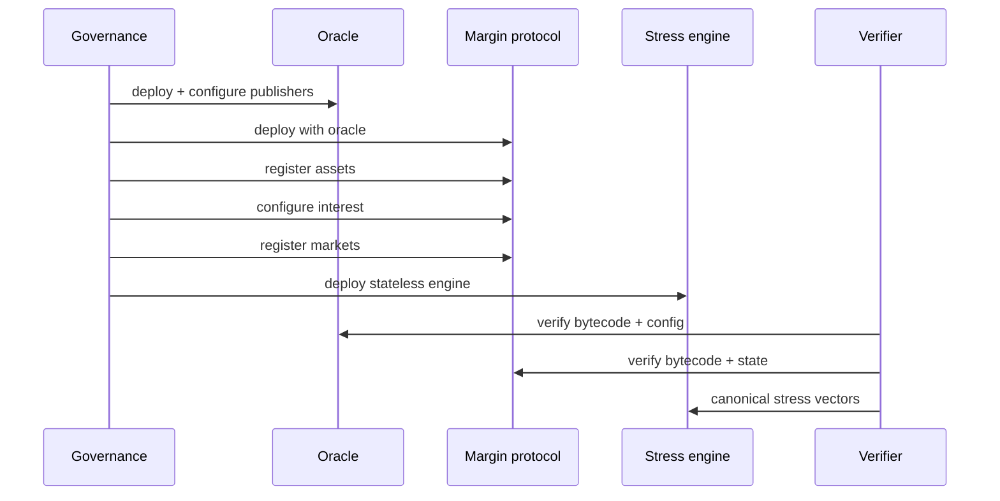
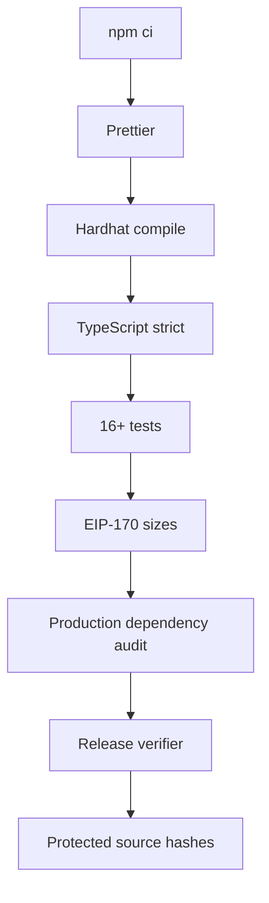

# Despliegue y promoción

La entrega estable conserva el mismo commit desde la revisión hasta el release. El pipeline compila con lockfile, ejecuta pruebas y typecheck, valida tamaño EIP-170, documentación, banner y hashes de compatibilidad.

## Cadena de promoción



## Secuencia de contratos



Las direcciones y parámetros se guardan en un manifiesto por red. No se reutilizan direcciones de mocks ni claves de desarrollo.

## Gates de entrega



```bash
npm ci
npm run ci
```

## Verificación post-despliegue

- owner y oracle coinciden con el manifiesto;
- assets conservan token, decimales y factores aprobados;
- curvas y reserve factors son exactos;
- mercados parten con estado y leverage esperados;
- bytecode coincide con el artefacto del tag;
- una lectura de stress canónica devuelve el vector aprobado;
- eventos de inicialización quedan indexados y finalizados.

## Rollback

Los contratos no se actualizan implícitamente. Un rollback operativo usa pausa, `reduceOnly`, restauración de servicios o despliegue/migración gobernada. Nunca se cambia oracle o ownership para simular un rollback sin un plan de estado, balances, approvals y comunicación verificable.

La evidencia de entrega incluye PR, SHAs, Actions de `main`, `production`, tag y release, objeto tag anotado, hashes de contratos y banner, resultados de pruebas y manifiesto de red.
